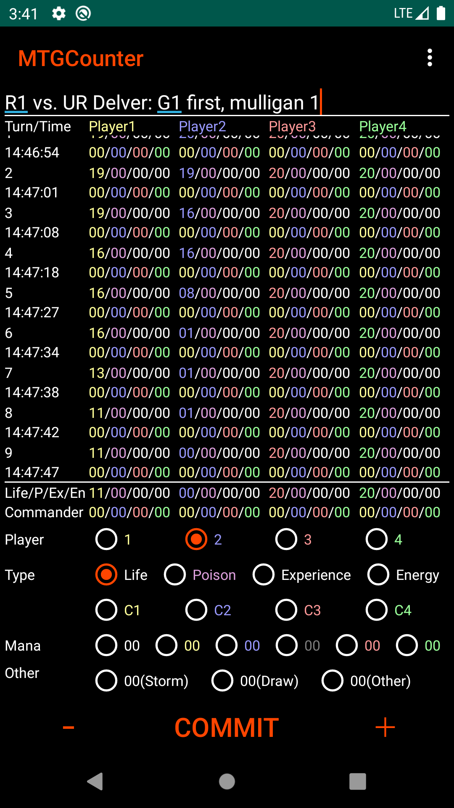
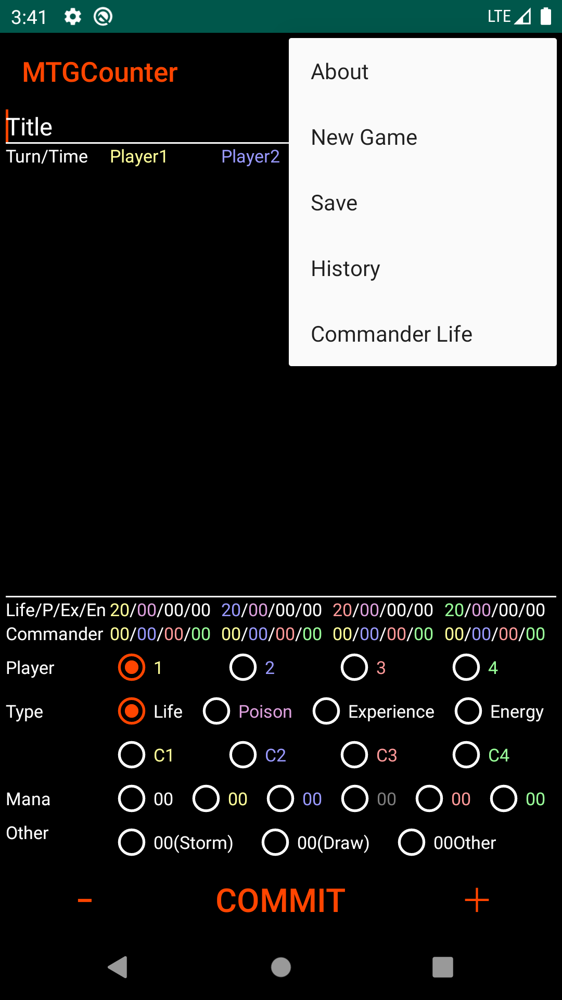
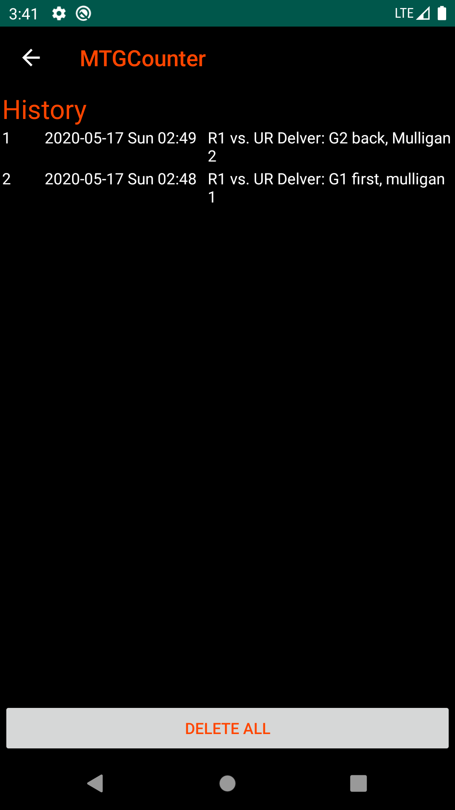
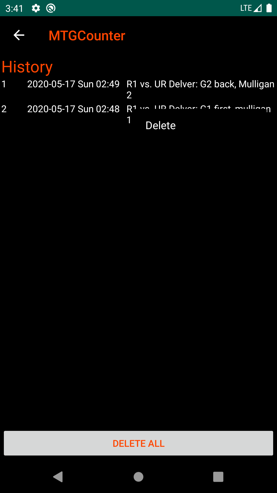
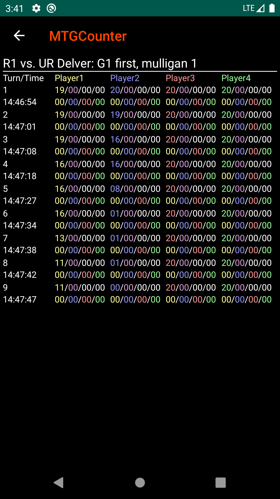

# MTGCounter

Life counter application for the Magic: The Gathering (MTG).

Now on release at [Google Play](https://play.google.com/store/apps/details?id=jp.senooken.android.mtgcounter) since 2020-05-23.

## Introduction
MTGCounter is the life counter Android application for the Magic: The Gathering (MTG).

This life counter application has following features.

- Count many type (life, poison, experience, energy, mana, storm, draw).
- Trailing life history.
- Save and view game history.
- Support commander.
- Support old Android (since Android 4.0.3 API level 15).
- Open Source (https://github.com/senooken/MTGCounter).
- No advertisement.end

If you find any bugs or have suggestion, please tell me by e-mail (contact@senooken.jp) or GitHub issues (https://github.com/senooken/MTGCounter/issues).

## Screenshot

## Attribute
- Author: SENOO, Ken
- License: [CC0](https://creativecommons.org/publicdomain/zero/1.0/deed.en) 

## Usage

### Home
After launch MTGCounter, following home activity is shown.

Fill in [Title] text field.

[Title] is game title. This text is used by history description. Multiple line is allowed. So you can use this filed as memo (Side in/out, opponent public hand, your deck, opponent deck etc.).

After fill in title, you can count you and your opponent life by downwards buttons.

Select [Player] ID and counter [Type] in radio buttons. Then you can increment/decrement bottom of [-]/[+] buttons.

Current life is shown in middle of application. This area is editable. So you can update directly.

After fix life changes, select [COMMIT] button. Information of turn is committed and shown top list. In this list, value is editable except for [Turn/Time].

Bottom of 2 lines ([Mana], [Other]) are only counter. These entry is not saved in history.

### Menu

MTGCounter has menu options in home activity.

- [About]: Application information.
- [New Game]: Start new game.
- [Save]: Save current game to history.
- [History]: View old saved game history.
- [Commander Life]: Set all players life to 40 for commander.

### History

In [History] menu, all saved history are shown with ID, created date, title.

When select list item, saved game history is shown.

When long select list item, [Delete] menu is shown.

If you want to delete all history, select bottom of [DELETE ALL] button.

### Game History

When select an item in [History] menu, then game History is shown.

Game history is read only. You cannot modify saved history data.