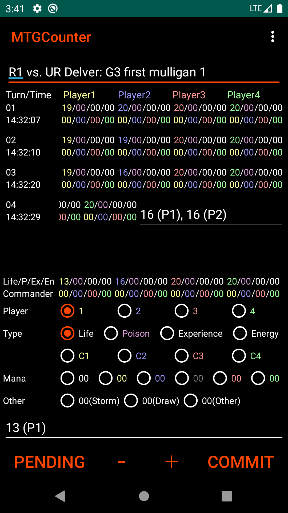
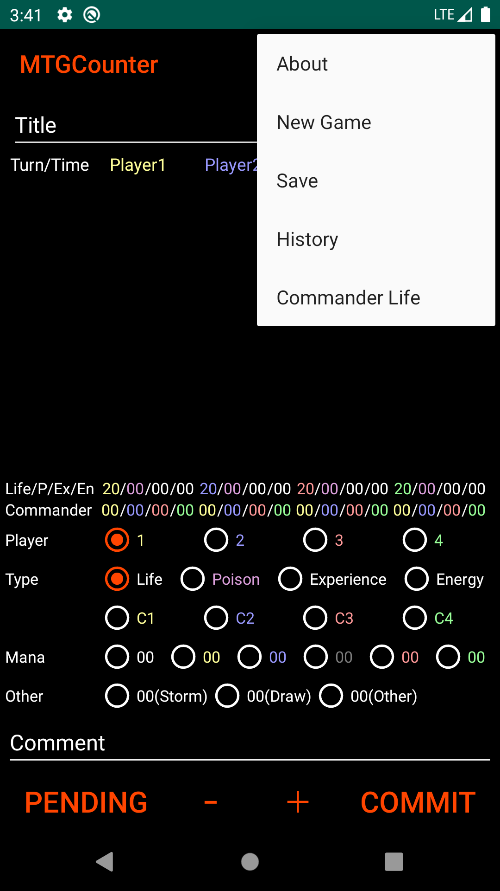
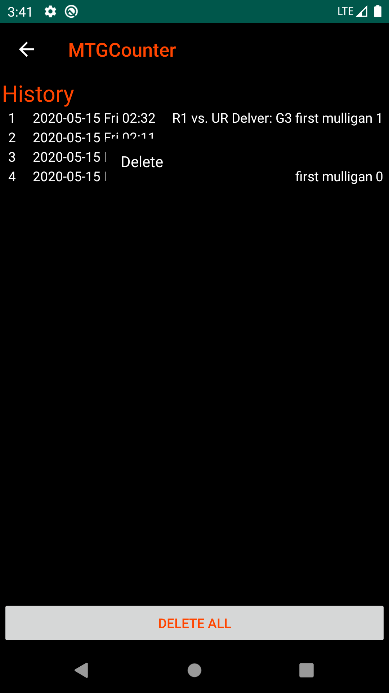

# MTGCounter

Counter application for the Magic: The Gathering (MTG).

## Introduction
MTGCounter is the counter Android application for the Magic: The Gathering (MTG).

This counter application has following features.

- Count many type (life, poison, experience, energy, mana, storm, draw).
- Trailing life history.
- Save and view game history.
- Support commander.
- Support old Android (since Android 4.0.3 API level 15).
- Open Source (https://github.com/senooken/MTGCounter).
- No advertisement.

If you find any bugs or have suggestion, please tell me by e-mail (contact@senooken.jp) or GitHub issues (https://github.com/senooken/MTGCounter/issues).

## Screenshot

## Attribute
- Author: SENOO, Ken
- License: [CC0](https://creativecommons.org/publicdomain/zero/1.0/deed.en) 

## Usage

### Home
After launch MTGCounter, following home activity is shown.

Fill in [Title] text fieled.

[Title] is game title. This text is used by history description. Multiple line is allowed. So you can use this filed as memo (Side in/out, opponent public hand, your deck, opponent deck etc.).

After fill in title, you can count you and your opponent life by downwards buttons.

Select [Player] ID and counter [Type] in radio buttons. Then you can increment/decrement bottom of [-]/[+] buttons.

Current life is shown in middle of application. This area is editable. So you can update directly.

You can fill in turn's comment in [COMMENT] field.

After fix life changes, select [COMMIT] button. Information of turn is commited and shown top list. In this list, value is editable except for [Turn/Time].

[COMMENT] fieled is shown end of right in list. You can slide list item to left and right .

If select [PENDING] button, append current life and player ID [COMMENT] field.

Bottom of 2 lines ([Mana], [Other]) are only counter. These entry is not saved in history.

### Menu

MTGCounter has menu opsions in home activity.

- [About]: Application information.
- [New Game]: Start new game.
- [Save]: Save current game to history.
- [History]: View old saved game history.
- [Commander Life]: Set all players life to 40 for commander.

### History

In [History] menu, all saved history are shown with ID, created date, title.

Game history is read only. You cannot modify saved history data.

When select list item, saved game history is shown.

When long select list item, [Delete] menu is shown.

If you want to delete all history, select bottom of [DELETE ALL] button.
