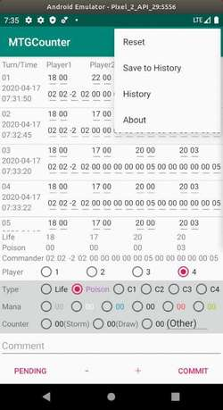
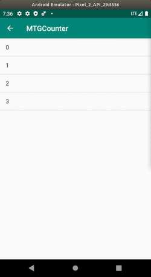

# MTGCounter
## Introduction
MTGCounter is the counter Android application for Magic: The Gathering (MTG).

This counter application has following features.

1. Trailing life history.
2. Count many type (life, poison, mana, storm, draw).
3. Commander.

## Screenshot

