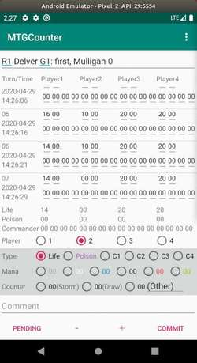

# MTGCounter
Counter Application for Magic: The Gathering (MTG).

## Introduction
MTGCounter is the counter Android application for Magic: The Gathering (MTG).

This counter application has following features.

- Count many type (life, poison, mana, storm, draw).
- Trailing life history.
- Save and view game history.
- Support commander.
- Support old Android (since Android 4.0.3 API level 15).
- Open Source (https://github.com/senooken/MTGCounter).
- No advertisement.

If you find any bugs or have suggestion, please let it me by e-mail (contact@senooken.jp) or GitHub issue (https://github.com/senooken/MTGCounter/issues).

## Screenshot

